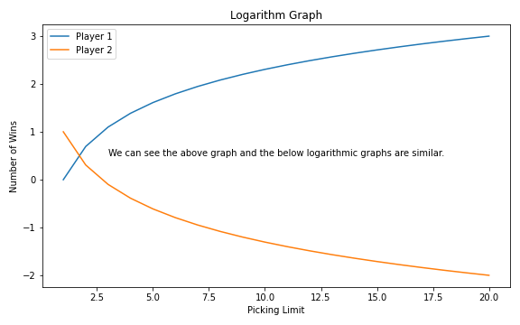

# nim-prob-sim
Probability Simulation of the nim game

## Game setup

- 2 player1
- each player gets a turn to remove/add a number between 0-`n`
- last one to reach `k` wins (k can be 0 or any positive number)

## test

given a random `k` and `n` (n<<k) what is the 
probability that 
- player 1 will win if he plays first
- player 1 will win if he plays second

*Provided both players play optimally*

## Result

